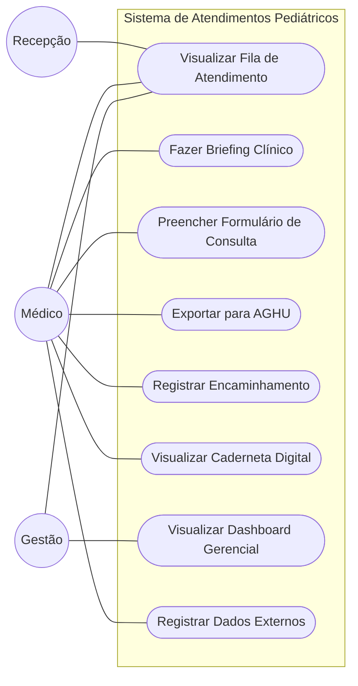

# Modelagem de Casos de Uso

## 1. Diagrama de Casos de Uso

---

## 2. Especificação dos Casos de Uso

### UC001 — Visualizar Fila de Atendimento

* **Atores:** Médico, Recepção, Gestão
* **Pré-condição:** Usuário autenticado com role válida.
* **Fluxo Principal:**
  1. Sistema exibe lista de pacientes do dia com nome, idade, prontuário, tipo de entrada, status e tempo de espera.
  2. Usuário seleciona paciente para visualizar briefing ou iniciar atendimento.
  3. Recepção pode transitar status de `Agendado` para `Aguardando`.
* **Status possíveis:** `Agendado` → `Aguardando` → `Em Atendimento` → `Pendente` → `Finalizado`
* **Exceção:** Paciente sem comparecimento permanece `Agendado` até cancelamento manual.

#### [CARE-UC001] Implementação da Fila

* **Context:** JWT válido na requisição. `GET /api/pacientes` retorna lista da fonte configurada (CSV ou PostgreSQL).
* **Action:** Frontend monta `QueueEntry[]` com dados do paciente e metadados de fila (entryType, status, waitTime, faltas). Componente `StatusBadge` renderiza o status com cor semântica.
* **Result:** Fila atualizada. Transição de status persiste no banco com timestamp.
* **Evaluation:** Verificar que os 4 tipos de entrada (Retorno, Egresso, Encaminhamento Externo, Internação) são renderizados corretamente com badges distintos.

---

### UC002 — Fazer Briefing Clínico

* **Atores:** Médico
* **Pré-condição:** Paciente na fila com status `Aguardando`.
* **Fluxo Principal:**
  1. Médico clica no paciente na fila.
  2. Sistema exibe briefing: dados demográficos, alertas ativos, linha do tempo das últimas consultas, padrão de condutas (CIDs frequentes, encaminhamentos sem retorno, internações) e últimos dados antropométricos com evolução de peso.
  3. Médico clica em "Iniciar Atendimento" → status muda para `Em Atendimento`, timer inicia, usuário é redirecionado para o formulário.
  4. Se consulta já estiver em andamento, botão exibe "Continuar Atendimento".
* **Exceção:** Prontuário completo disponível no AGHU; sistema exibe número do prontuário para cópia.

#### [CARE-UC002] Implementação do Briefing

* **Context:** Paciente selecionado armazenado em `PatientContext` (Vue store).
* **Action:** Tela `/briefing` carrega dados do contexto. Alertas renderizados com `AlertOctagon` (crítico/vermelho) ou `AlertTriangle` (atenção/âmbar) e badge de categoria. Consultas externas aparecem diferenciadas na linha do tempo com ícone `FileInput` e tooltip de origem.
* **Result:** Médico visualiza contexto completo. `activePatient` gravado no contexto para uso no formulário.
* **Evaluation:** Verificar que alertas de negligência exibem nível `critico`. Verificar que consultas externas mostram aviso de origem não-HC.

---

### UC003 — Preencher Formulário de Consulta

* **Atores:** Médico
* **Pré-condição:** Atendimento iniciado. `activePatient` definido no contexto.
* **Fluxo Principal:**
  1. Sistema exibe formulário em abas com timer visível no topo.
  2. Médico preenche **Antropometria**: peso, altura, perímetro cefálico. IMC e percentil calculados automaticamente.
  3. Médico preenche **Anamnese**: queixa principal, alimentação (select), sono (select com alerta condicional), higiene.
  4. Médico seleciona sistemas no **Exame Físico**: chips clicáveis → formulário expandido por sistema → status Normal/Alterado → campos condicionais (fontanelas para ≤18 meses; reflexos primitivos para ≤12 meses). Sistemas não selecionados = "não avaliado".
  5. Médico avalia **Marcos do Desenvolvimento**: tabela por faixa etária. Células editáveis apenas dentro da janela de idade atual.
  6. Se paciente tiver 16–30 meses, médico aplica **M-CHAT-R**: 20 questões Sim/Não. Score calculado em tempo real. Encaminhamento automático para Neurologia se risco médio ou alto.
  7. Médico registra **Diagnóstico**: CID-10 principal (obrigatório para encaminhamentos) + até 5 CIDs secundários + SID.
  8. Médico adiciona **Procedimentos** (se realizados): nome, quantidade, CID vinculado.
  9. Médico adiciona **Encaminhamentos**: especialidade, procedimento, prioridade, justificativa.
  10. Médico pode salvar rascunho a qualquer momento.
  11. Ao finalizar: validação (CID obrigatório se há encaminhamentos; CID vinculado obrigatório em procedimentos) → texto AGHU gerado → modal de exportação.
* **Fluxo Alternativo — Dados Externos:** Médico pode registrar dados de atendimentos em outros serviços (seção colapsável). Campo "Como os dados foram obtidos" é obrigatório. Dados externos aparecem na linha do tempo com marcação de origem externa.

#### [CARE-UC003] Implementação do Formulário

* **Context:** `activePatient` disponível em `PatientContext`. Formulário em `/consulta`.
* **Action:** Estado gerenciado localmente (React useState equivalente em Vue). Timer incrementa a cada segundo. M-CHAT-R: itens invertidos têm lógica negada no cálculo de score. Exportação AGHU gera texto pré-formatado com todos os campos.
* **Result:** Consulta registrada. Texto exportado para AGHU. `clearActivePatient()` chamado ao finalizar.
* **Evaluation:** Verificar score M-CHAT-R (≤2 baixo, 3–7 médio, ≥8 alto). Verificar bloqueio de finalização sem CID quando há encaminhamento. Verificar que dados externos exigem campo de origem.

---

### UC004 — Exportar para AGHU

* **Atores:** Médico
* **Pré-condição:** Formulário preenchido. CID-10 informado se há encaminhamentos.
* **Fluxo Principal:**
  1. Médico clica em "Copiar para AGHU e Finalizar".
  2. Sistema valida presença de CID se há encaminhamentos.
  3. Modal exibe texto estruturado com todos os dados da consulta formatados.
  4. Médico copia o texto → cola no campo de evolução do AGHU → assina com certificado Certbr.
  5. Consulta finalizada. `activePatient` limpo. Redirecionamento para fila.

---

### UC005 — Registrar Encaminhamento

* **Atores:** Médico
* **Pré-condição:** Formulário de consulta aberto. CID-10 principal informado.
* **Fluxo Principal:**
  1. Médico adiciona encaminhamento: especialidade (lista predefinida), procedimento/motivo, prioridade (Eletivo / Prioritário / Urgente), justificativa clínica.
  2. Sistema gera ficha de encaminhamento (modal) com dados do paciente, especialidade, justificativa e dados antropométricos relevantes.
  3. Médico copia ou imprime a ficha para entrega à família.
* **Encaminhamento Automático (M-CHAT-R):** Se score médio → encaminhamento para Neurologia com "Entrevista de seguimento M-CHAT-R/F". Se score alto → encaminhamento Urgente com justificativa de avaliação diagnóstica TEA.

---

### UC006 — Visualizar Caderneta Digital

* **Atores:** Médico, Paciente/Responsável
* **Pré-condição:** Paciente selecionado.
* **Fluxo Principal:**
  1. Acesso via botão "Ver Caderneta Digital" no briefing.
  2. Sistema exibe curvas de crescimento (peso, altura, IMC) com percentis e pontos históricos.
  3. Marcos de desenvolvimento registrados em consultas anteriores são exibidos no histórico.

---

### UC007 — Visualizar Dashboard Gerencial

* **Atores:** Gestão
* **Pré-condição:** Usuário com role `gestão` autenticado.
* **Fluxo Principal:**
  1. Usuário seleciona período (7/30/90 dias).
  2. Sistema exibe: KPIs (consultas realizadas, tempo médio vs. meta 45min, taxa de encaminhamentos, formulários incompletos, taxa de retorno de encaminhamentos, alertas de negligência), gráficos de consultas por tipo e tempo médio por semana, CIDs mais frequentes, efetividade de encaminhamentos por especialidade, tabela de alertas populacionais filtrável por categoria.
  3. Usuário pode filtrar alertas por categoria (peso, marco, encaminhamento, falta, negligência).
  4. Usuário clica em "Ver Briefing" para acessar o paciente com alerta ativo.
