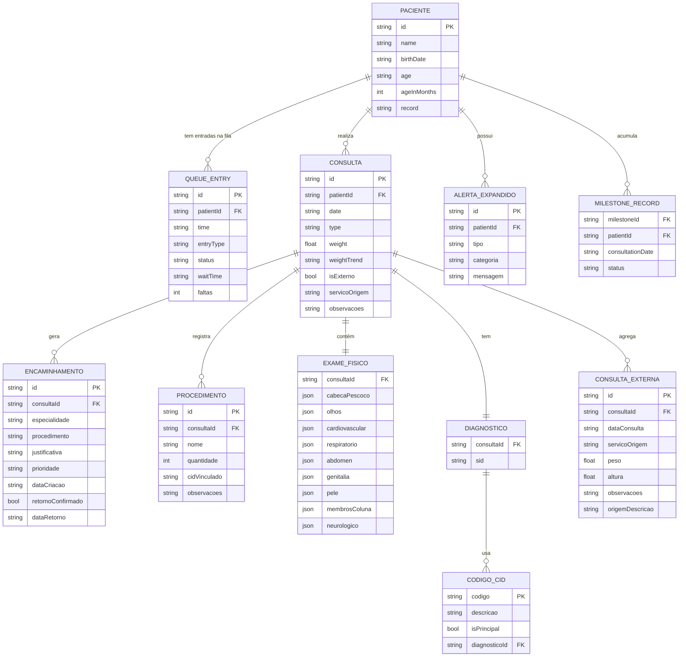

# Modelo de Dados e Dicionário

## 1. Modelo Entidade-Relacionamento



---

## 2. Dicionário de Dados

### PACIENTE

| Campo | Tipo | Descrição |
|---|---|---|
| id | string | Identificador único do paciente |
| name | string | Nome completo |
| birthDate | string | Data de nascimento (formato dd/mm/yyyy) |
| age | string | Idade formatada para exibição (ex: "1 ano e 7 meses") |
| ageInMonths | int | Idade em meses — usado para lógica de marcos, M-CHAT-R e campos condicionais |
| record | string | Número de prontuário no AGHU |

---

### QUEUE_ENTRY

| Campo | Tipo | Valores possíveis | Descrição |
|---|---|---|---|
| entryType | string (enum) | Retorno, Egresso, Encaminhamento Externo, Internação | Tipo de entrada na consulta |
| status | string (enum) | Agendado, Aguardando, Em Atendimento, Pendente, Finalizado | Status atual na fila |
| waitTime | string \| null | — | Tempo de espera formatado |
| faltas | int | — | Número de faltas anteriores |

---

### CONSULTA

| Campo | Tipo | Descrição |
|---|---|---|
| weightTrend | string (enum) | `up`, `down`, `stable` — tendência do peso em relação à consulta anterior |
| isExterno | bool | Indica dado de atendimento externo ao HC |
| servicoOrigem | string | Serviço de saúde externo de origem (ex: "UBS Mangueira") |

---

### EXAME_FISICO — Sistemas

Cada sistema é um objeto com estrutura `SistemaExame`:

| Campo | Tipo | Valores | Descrição |
|---|---|---|---|
| status | string (enum) | `normal`, `alterado`, `nao-avaliado` | Status do sistema nesta consulta |
| descricao | string | — | Preenchido apenas quando `status === "alterado"` |

**Sistemas cobertos:** cabecaPescoco, olhos, cardiovascular, respiratorio, abdomen, genitalia, pele, membrosColuna, neurologico.

**Campos condicionais:**
- `fontanelas` em `cabecaPescoco` — exibido apenas se `ageInMonths <= 18`. Valores: `normal`, `alterado-abaulada`, `fechada-precoce`.
- `reflexos` em `neurologico` — exibido apenas se `ageInMonths <= 12`. Valores: `presentes`, `ausentes`, `assimetricos`.

---

### DIAGNOSTICO / CODIGO_CID

| Campo | Tipo | Descrição |
|---|---|---|
| codigo | string | Código CID-10 (ex: "Z00.1") ou SID |
| descricao | string | Descrição do CID (ex: "Exame médico geral do lactente") |
| isPrincipal | bool | Primeiro item da lista é sempre o CID principal |
| sid | string | Código SID do serviço; string vazia quando não aplicável |

**Regra:** CID-10 principal obrigatório quando há encaminhamentos ou procedimentos vinculados. Máximo de 5 CIDs secundários.

---

### ENCAMINHAMENTO

| Campo | Tipo | Valores | Descrição |
|---|---|---|---|
| prioridade | string (enum) | `Eletivo`, `Prioritário`, `Urgente` | Prioridade clínica do encaminhamento |
| retornoConfirmado | bool | — | Paciente foi atendido pelo especialista e retorno registrado |
| dataRetorno | string \| null | — | Data de confirmação do retorno |

---

### CONSULTA_EXTERNA

| Campo | Tipo | Obrigatório | Descrição |
|---|---|---|---|
| origemDescricao | string | Sim | Como os dados foram obtidos (ex: "Dados fornecidos pela mãe a partir de caderneta física") — campo de rastreabilidade obrigatório pela LGPD |

---

### MILESTONE_RECORD

| Campo | Tipo | Valores | Descrição |
|---|---|---|---|
| milestoneId | string | — | Referência ao marco de desenvolvimento |
| status | string (enum) | `confirmed`, `not-evaluated`, `not-achieved` | Resultado da avaliação nesta consulta |

**Marcos organizados por faixa etária:** 0–3m, 3–6m, 6–12m, 1–2a, 3,5–5a.

---

### ALERTA_EXPANDIDO

| Campo | Tipo | Valores | Descrição |
|---|---|---|---|
| tipo | string (enum) | `critico`, `atencao` | Severidade do alerta |
| categoria | string (enum) | `peso`, `marco`, `encaminhamento`, `falta`, `negligencia` | Categoria do alerta para filtragem |

---

## 3. Regras de Integridade

- **Soft Delete obrigatório:** Toda exclusão lógica usa `deleted_at`. Proibido `DELETE` SQL em entidades de domínio.
- **Auditoria:** Toda transição de status de `QueueEntry` gera registro com timestamp.
- **Rastreabilidade de dados externos:** Campo `origemDescricao` em `ConsultaExterna` é obrigatório — valido no backend antes de persistir.
- **CID-10 para encaminhamentos:** Encaminhamento só pode ser gerado se `cidPrincipal` estiver preenchido.
- **CID vinculado em procedimentos:** Todo `Procedimento` deve ter `cidVinculado` antes de exportar para o AGHU.
- **M-CHAT-R automático:** Encaminhamento para Neurologia gerado automaticamente quando score indica risco médio ou alto. Não pode ser removido sem justificativa.

---

## 4. Schema JSON — Paciente

```json
{
  "$schema": "http://json-schema.org/draft-07/schema#",
  "title": "Paciente",
  "type": "object",
  "properties": {
    "id": { "type": "string" },
    "name": { "type": "string", "minLength": 3 },
    "birthDate": { "type": "string", "pattern": "^[0-9]{2}/[0-9]{2}/[0-9]{4}$" },
    "age": { "type": "string" },
    "ageInMonths": { "type": "integer", "minimum": 0 },
    "record": { "type": "string", "minLength": 1 }
  },
  "required": ["id", "name", "birthDate", "ageInMonths", "record"]
}
```
