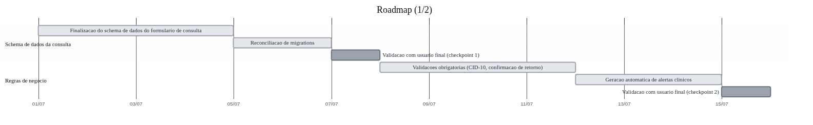
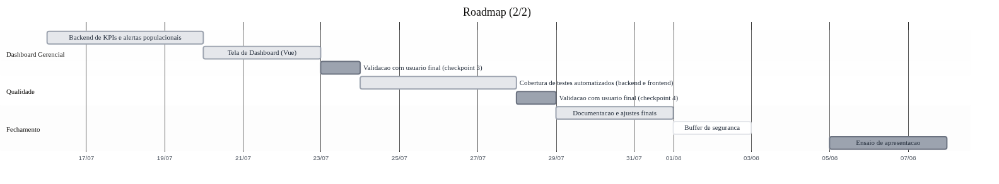

# Roadmap — Próximos Passos

> Gerado a partir de uma análise completa do repositório (backend, frontend, mockup, docs) cruzada com os PRs abertos/mergeados no GitHub, em 2026-07-01 (atualizado após o merge dos PRs #21 e #24). Substitui a leitura do `SPEC.md` como fonte de progresso — os checkboxes lá estão desatualizados (ver item 12).

## Como ler este documento

Os itens estão agrupados por categoria de prioridade: lacunas de schema (bloqueiam persistência de dados clínicos), funcionalidades documentadas e nunca iniciadas, guardrails não aplicados no código, qualidade e infraestrutura, e um item de processo. Cada um traz uma descrição breve do estado atual com referências a arquivos reais — não são suposições.

---

## Cronograma até o Demo Day (07/08)

Dividido em duas imagens (fundo transparente, para uso em dois slides):

Fonte dos diagramas (Mermaid, regenerável com `npx @mermaid-js/mermaid-cli -i roadmap-gantt-N.mmd -o roadmap-gantt-N.png -b transparent`): `assets/roadmap-gantt-1.mmd` e `assets/roadmap-gantt-2.mmd`.

| Semana | Datas | Entrega |
|---|---|---|
| 1 | 01–06/07 | Finalização do schema de dados do formulário de consulta + reconciliação de migrations |
| — | 07/07 | Checkpoint 1 de validação com usuário final |
| 2 | 08–14/07 | Validações obrigatórias (CID-10, confirmação de retorno) + geração automática de alertas |
| — | 15/07 | Checkpoint 2 de validação com usuário final |
| 3 | 16–22/07 | Dashboard Gerencial — backend de KPIs/alertas populacionais + tela Vue |
| — | 23/07 | Checkpoint 3 de validação com usuário final |
| 4 | 24–27/07 | Cobertura de testes automatizados (backend e frontend) |
| — | 28/07 | Checkpoint 4 de validação com usuário final |
| 5 | 29/07–02/08 | Documentação e ajustes finais + buffer de segurança |
| 05–07/08 | — | Ensaio de apresentação / Demo Day |

RBAC por papel não entrou no cronograma — a integração com AD já cobre esse controle em produção. Integração real com AGHU também fica fora: é um bloqueio externo (depende de mapeamento de endpoints do time do AGHU), não um item que dependa só do time do projeto.

---

## Categoria 1 — Lacunas de schema: bloqueiam "formulário completo" de verdade

### 1. Exame Físico sem persistência
Nenhuma tabela existe no banco para essa seção do formulário. Hoje os dados vivem só no Pinia (`frontend/src/stores/consulta.ts`) e se perdem ao recarregar a página. Precisa de: model SQLAlchemy (`ConsultaExameFisico`), migration Alembic, e endpoint em `src/routers/consulta.py` para salvar/carregar.

### 2. M-CHAT-R sem persistência
Mesma situação do Exame Físico. O PR #21 ("Feat/mchatr", já mergeado) implementou só a UI (`SecaoMCHATR.vue` + dados de perguntas em `frontend/src/data/mchat-perguntas.ts`) — não criou nenhum model, migration ou endpoint no backend. A lacuna de persistência continua existindo.

### 3. Encaminhamento sem confirmação de retorno
O tipo `retornoConfirmado`/`dataRetorno` existe em `frontend/src/types/clinica.ts` mas não é lido nem escrito por nenhum componente, e não existe como coluna no model `ConsultaEncaminhamento` do backend. TASK-010 do SPEC.md (`PATCH /api/encaminhamentos/{id}/retorno`) nunca foi implementada.

### 3.1. "Ver detalhes" e "Reabrir" de consulta histórica removidos do Briefing
No histórico de consultas do Briefing Clínico existiam dois botões, "Ver detalhes" (ia para `/consulta/historico?date=...`, rota inexistente) e "Reabrir" (ia para `/consulta?reopen=true&date=...`, que `Consulta.vue` não trata — apenas abria um formulário em branco). Foram removidos por quebrarem a navegação (PR #25). Falta: uma tela real de detalhe de consulta histórica e uma forma de reabrir/editar uma consulta finalizada.

O mesmo PR também corrigiu duas falhas relacionadas de modo leitura: `Consulta.vue` não verificava `pacienteStore.modoLeitura` (só se havia paciente ativo), então um paciente aberto via Base de Pacientes podia acabar no formulário de atendimento; e o link "Formulário de Consulta" na sidebar (`AppLayout.vue`) ficava visível mesmo em modo leitura, levando ao mesmo problema — agora o link some nesse caso, igual já acontecia com os botões de iniciar/continuar atendimento no Briefing.

### 4. Migração Alembic inicial divergente dos models atuais
`alembic/versions/a1b2c3d4e5f6_create_clinical_tables.py` define tabelas obsoletas (`consulta_exame_fisico`, `consulta_mchat`, `consulta_marcos`, `consulta_diagnosticos` no plural) que não batem com os models reais (`consulta_marcos_desenvolvimento`, `consulta_diagnostico` no singular, sem exame_fisico/mchat). Funciona em dev porque o SQLite local é criado via `Base.metadata.create_all` na inicialização (`src/main.py`), não via Alembic — mas rodar `alembic upgrade head` contra um Postgres real hoje geraria um schema quebrado/divergente. Precisa de uma migration de reconciliação antes de qualquer deploy real ou de usar Alembic em CI/staging.

---

## Categoria 2 — Funcionalidades documentadas e nunca começadas

### 5. Dashboard Gerencial (RF007)
Única tela do mockup (`mockup/app/dashboard/page.tsx`) sem nenhum equivalente Vue. Zero backend (TASK-014/015/016 do SPEC.md — KPIs, alertas populacionais, efetividade de encaminhamentos), zero frontend. Provavelmente o maior bloco de trabalho restante do projeto.

### 6. Geração automática de alertas (RF008 / TASK-012)
Os endpoints de alertas (`src/routers/alertas.py`, PR #22) só criam registros manualmente via `POST /api/alertas`. Não existe nenhuma lógica de negócio rodando sozinha que detecte peso abaixo da curva esperada, falta consecutiva, marco não confirmado etc. e gere o alerta automaticamente — hoje isso é 100% manual em produção (o script `scripts/seed_dev_data.py` só simula esse comportamento para dados de desenvolvimento).

### 7. RBAC incompleto
Só o grupo `GLO-SEC-HCPE-SETISD` (admin) é checado em algum lugar (`src/routers/admin.py`). Os outros 3 papéis documentados em `docs/docs/06-arquitetura.md` §3.2 (médico_hc, médico_satélite, recepção, gestão) não têm nenhuma restrição de rota no frontend nem de endpoint no backend — qualquer usuário autenticado enxerga e faz tudo hoje. **Fora do cronograma de curto prazo**: a integração com AD em produção já resolve o controle de acesso por grupo — não é prioridade implementar essa lógica adicional agora.

### 8. Integração real com AGHU (TASK-017/018)
Segue 100% CSV (dev) / mock. Não existe `AGHUProvider` real. Isso é um bloqueio externo — depende do mapeamento de endpoints do time do AGHU (ADR-002) — mas vale manter explícito no roadmap como "aguardando input externo", não como item esquecido.

---

## Categoria 3 — Guardrails documentados mas não aplicados no código

### 9. CID-10 obrigatório para encaminhamento
O critério de verificação global do SPEC.md exige isso, mas hoje `_diagnostico_completo()` em `src/routers/consulta.py` só é usado como indicador visual de "seção completa" na UI — o backend aceita salvar um encaminhamento sem nenhum CID preenchido.

---

## Categoria 4 — Qualidade e infraestrutura

### 10. Cobertura de teste só em `src/controllers/`
Providers (incluindo os mais recentes: `alertas_sqlite_provider.py`, `fila_csv_provider.py`) e routers não têm nenhum teste automatizado. Um bug de SQL ou de mapeamento de resposta só aparece em produção/manual.

### 11. Frontend sem nenhuma infra de teste
`frontend/package.json` não tem vitest/jest configurado — zero testes de componente ou de store Pinia.

### 12. Docs desatualizadas
`docs/docs/SPEC.md` tem os checkboxes da Fase 2 em diante quase todos marcados como pendente mesmo com boa parte já implementada (módulo de consulta, briefing, caderneta). `CLAUDE.md` tem uma seção "dívida técnica ativa" (§12/§13) descrevendo um estado que já foi resolvido (o `--cov-fail-under=100` já está no CI) — e `src/tests/unit/test_placeholder.py` nunca foi removido como o próprio guardrail manda.

### 13. Total de paginação incorreto no provider Postgres
`src/providers/implementations/paciente_postgres_provider.py` retorna `"total": len(items)` (total da página atual, não da base toda) — já marcado como TODO no próprio código. A paginação da tela de Pacientes vai mostrar número errado assim que a estratégia mudar de CSV pra Postgres em produção.

---

## Categoria 5 — Antes de investir mais tempo

### 14. Validação com usuário final
Ainda não validamos o fluxo real com médicos/recepção do HC. Antes de atacar o Dashboard (item grande, cerca de 1 a 2 semanas) ou a geração automática de alertas, faz sentido rodar uma sessão de uso com a base de dados já seedada (PR #22 e ajustada pelo PR #24 — hoje 10 pacientes de teste, incluindo neonatais/lactentes, com histórico clínico compatível com a idade de cada um; `uv run python scripts/seed_dev_data.py`) para confirmar que o fluxo Fila → Briefing → Consulta → Caderneta bate com a expectativa real de uso, antes de expandir escopo com base só em suposições do mockup original.
